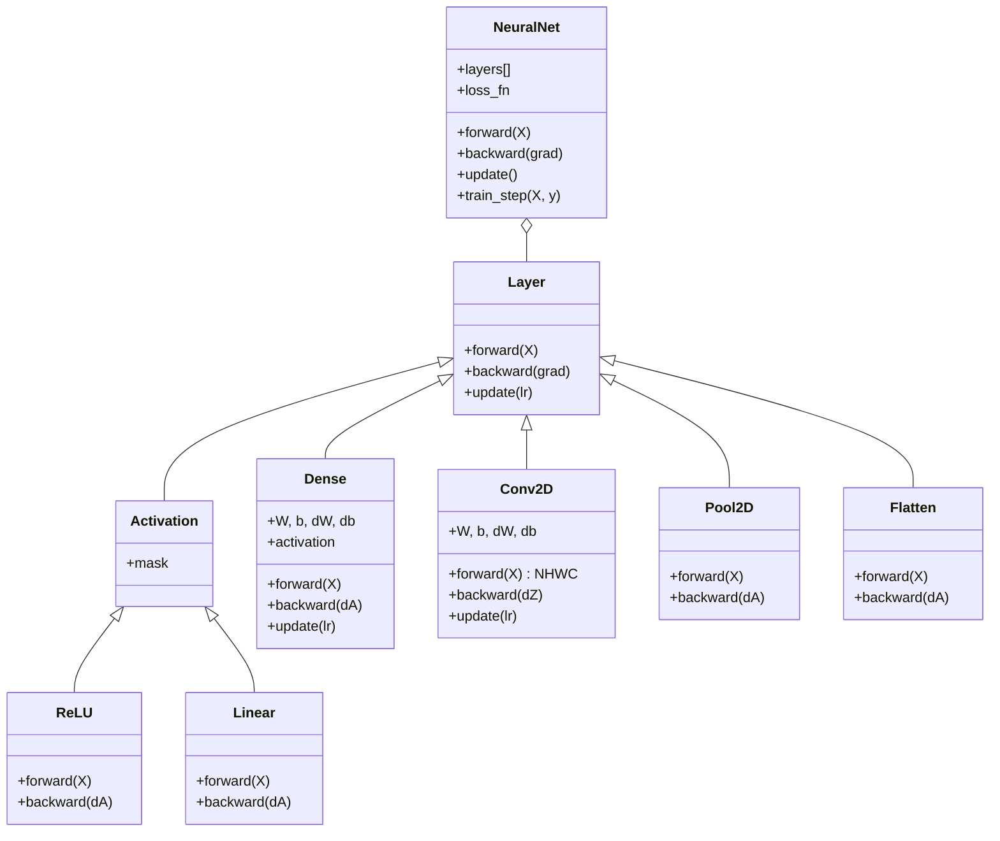
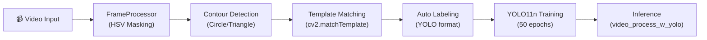
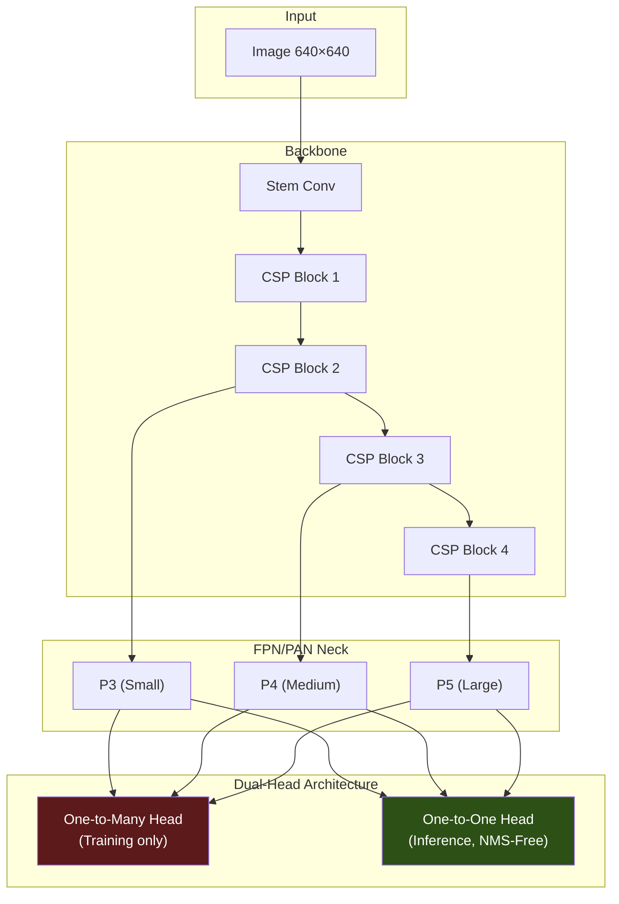
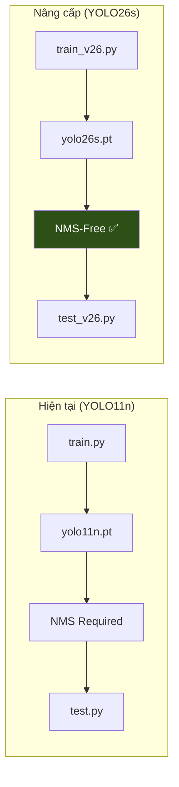
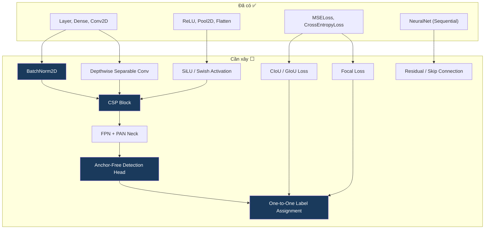
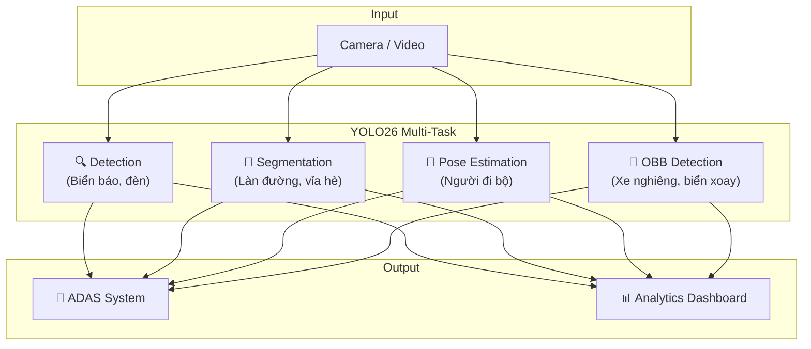
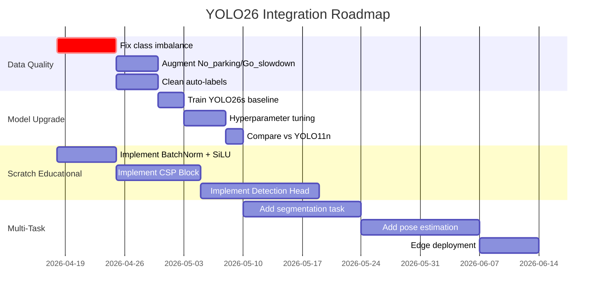

# 📊 Phân Tích Chuyên Sâu Dự Án My-Deep-Learning & Hướng Triển Khai YOLO26

---

## 1. Tổng Quan Dự Án

**My-Deep-Learning** là một dự án giáo dục về Deep Learning với 3 trụ cột chính:

| Thành phần | Mô tả | Trạng thái |
|:---|:---|:---|
| **Scratch** (NumPy) | Xây dựng neural network từ đầu: Dense, Conv2D, Pool2D, ReLU, Flatten, Loss functions | ✅ Hoàn thành |
| **PyTorch** | Rebuild các kiến trúc nổi tiếng (CNN/AlexNet) | 🔄 Đang phát triển |
| **Demo Application** | Ứng dụng thực tế — Nhận diện biển báo giao thông (YOLO11n) | ✅ Đã train 50 epochs |

---

## 2. Phân Tích Chi Tiết Từng Module

### 2.1 Scratch Module — Neural Net từ NumPy

Codebase gồm 3 file chính ([layers.py](file:///d:/Download/ComputerVision/My-Deep-Learning/scratch/layers.py), [models.py](file:///d:/Download/ComputerVision/My-Deep-Learning/scratch/models.py), [losses.py](file:///d:/Download/ComputerVision/My-Deep-Learning/scratch/losses.py)):



**Đánh giá kỹ thuật:**

| Khía cạnh | Đánh giá | Ghi chú |
|:---|:---|:---|
| He Initialization | ✅ Đúng | `np.sqrt(2.0 / fan_in)` cho cả Dense và Conv2D |
| Backprop Dense | ✅ Chính xác | Gradient chia batch size `m` |
| Backprop Conv2D | ✅ Chính xác | Naive 4-loop, đúng logic padding removal |
| Max Pooling backward | ✅ Đúng | Sử dụng argmax mask |
| CrossEntropyLoss | ✅ Ổn định | Có log-sum-exp trick (`shifted = logits - max`) |
| MSELoss | ✅ Đúng | Chuẩn `1/(2m) * ||y_pred - y_true||²` |

> [!TIP]
> **Điểm mạnh**: Code rất sạch, có docstring mỗi method, logic toán học chính xác. Phù hợp mục đích giáo dục.

> [!WARNING]
> **Hạn chế hiện tại cần bổ sung cho YOLO26 roadmap:**
> - Thiếu **Batch Normalization** — thành phần bắt buộc trong mọi backbone hiện đại
> - Thiếu **Sigmoid / SiLU (Swish)** activation — YOLO26 sử dụng SiLU
> - Thiếu **Depthwise Separable Convolution** — cốt lõi của lightweight models
> - Thiếu **Residual Connection (Skip Connection)** — foundation của CSP/ResNet blocks
> - Conv2D chạy naive 4-loop → rất chậm, cần im2col optimization

---

### 2.2 Demo Application — Traffic Sign Detection (YOLO11n)

#### Pipeline hiện tại



#### Kết quả Training YOLO11n (50 epochs)


**Metrics cuối cùng (Epoch 50):**

| Metric | Giá trị | Đánh giá |
|:---|:---|:---|
| **mAP50** | **94.66%** | 🟢 Tốt |
| **mAP50-95** | **84.67%** | 🟢 Rất tốt |
| Precision | 90.11% | 🟢 Cao |
| Recall | 77.60% | 🟡 Trung bình — cần cải thiện |
| Box Loss (val) | 0.374 | 🟢 Hội tụ tốt |
| Cls Loss (val) | 0.657 | 🟡 Còn cao — class imbalance |

#### Confusion Matrix — Vấn đề nghiêm trọng


> [!CAUTION]
> **Các vấn đề chính phát hiện từ Confusion Matrix:**
> 1. **No_parking**: 75% bị phân loại nhầm thành **background** → Model gần như không detect được class này
> 2. **Keep_going**: 44% bị nhầm thành **No_entry** — hai biển có hình tròn tương tự
> 3. **No_parking_stopping**: Chỉ 7% accuracy trên No_parking, 25% thành background
> 4. **Go_slowdown**: Không có mẫu nào trong confusion matrix → có thể thiếu data hoàn toàn

**Nguyên nhân gốc rễ:**
- **Data imbalance nghiêm trọng** giữa 6 classes
- Auto-labeling pipeline (template matching) tạo ra noise labels
- YOLO11n quá nhỏ (chỉ ~2.6M params) cho 6-class fine-grained recognition
- Dataset nhỏ (3,087 frames từ 1 video duy nhất)

---

## 3. YOLO26 — Kiến Trúc & Đổi Mới Chính

YOLO26 (phát hành 14/01/2026 bởi Ultralytics) là thế hệ YOLO mới nhất, thiết kế cho **edge-first deployment**.

### 3.1 Architecture Overview



### 3.2 So sánh YOLO11 (đang dùng) vs YOLO26

| Feature | YOLO11n (Hiện tại) | YOLO26n (Đề xuất) | Lợi ích |
|:---|:---|:---|:---|
| **Post-processing** | Cần NMS | **NMS-Free (End-to-End)** | Giảm 43% latency trên CPU |
| **Detection Head** | Single head + DFL | **Dual-Head, loại bỏ DFL** | Đơn giản hóa graph, tương thích edge |
| **Small objects** | Standard | **ProgLoss + STAL** | Tốt hơn cho biển báo nhỏ, xa |
| **Optimizer** | SGD/AdamW | **MuSGD** (SGD + Muon) | Hội tụ nhanh, ổn định hơn |
| **BBox parameterization** | DFL-based regression | **Hardware-friendly direct** | Tương thích TFLite, CoreML, ONNX |
| **mAP50-95 (COCO)** | ~39.5% | **~40.3%** | Tăng accuracy ở cùng model size |
| **Multi-task** | Detect, Segment, Pose | + **OBB, Classification, YOLOE** | Hệ sinh thái rộng hơn |

### 3.3 Model Variants & Benchmark

| Variant | mAP50-95 (COCO) | T4 Latency | CPU Latency (ONNX) | Phù hợp cho |
|:---|:---|:---|:---|:---|
| **yolo26n** | ~40.3% | ~1.7ms | ~38.9ms | Edge/IoT, Raspberry Pi |
| **yolo26s** | ~47.2% | ~87ms | — | Mobile, embedded |
| **yolo26m** | ~51.5% | ~220ms | — | Production server |
| **yolo26l** | ~53.4% | ~286ms | — | High-accuracy cần |
| **yolo26x** | ~56.9% | ~526ms | — | Maximum performance |

---

## 4. Hướng Triển Khai YOLO26 Cho Dự Án

### 📋 Hướng 1: Drop-in Upgrade — Nâng cấp Traffic Sign Detection

**Mục tiêu**: Thay thế YOLO11n bằng YOLO26 trong pipeline hiện tại, cải thiện accuracy đặc biệt trên small objects.



**Thay đổi code cần thiết:**

```diff
# train.py
- model = YOLO('yolo11n.pt')
+ model = YOLO('yolo26s.pt')  # Nâng lên 's' để handle 6-class tốt hơn

  results = model.train(
      data='data.yaml',
-     epochs=50,
+     epochs=100,          # YOLO26 cần nhiều epochs hơn nhờ MuSGD
      imgsz=640,
      device=0,
-     batch=16,
+     batch=32,            # YOLO26 lightweight hơn, dùng batch lớn hơn
      workers=0,
+     patience=20,         # Early stopping
+     augment=True,        # Bật augmentation
+     cos_lr=True,         # Cosine LR scheduler
      name='traffic_detect_yolo26'
  )
```

```diff
# test.py — đơn giản hóa nhờ NMS-free
- WEIGHTS = "runs/detect/traffic_detect_run3/weights/best.pt"
+ WEIGHTS = "runs/detect/traffic_detect_yolo26/weights/best.pt"
  model = YOLO(WEIGHTS)
  
  # Inference giờ đã end-to-end, không cần tune NMS thresholds
  result = model(frame)[0]
+ # Boxes đã là non-redundant, không cần agnostic_nms
```

> [!IMPORTANT]
> **Khuyến nghị model size:** Dùng **yolo26s** thay vì `yolo26n` cho traffic sign detection vì:
> - 6 classes with fine-grained differences (No_parking vs No_parking_stopping)
> - Small objects cần feature maps rich hơn
> - `yolo26s` (~47.2% mAP) vẫn rất nhanh trên GPU

**Estimated improvement:**
- mAP50: 94.66% → **96-97%** (nhờ STAL cho small targets)
- Recall: 77.60% → **82-85%** (nhờ ProgLoss balance)
- No_parking detection: ~25% → **60-70%** (nhờ better label assignment)

---

### 📋 Hướng 2: Xây Dựng YOLO26 Components Từ Scratch (Mở rộng Scratch module)

**Mục tiêu**: Mở rộng scratch module hiện tại để implement các building blocks cốt lõi của YOLO26, phục vụ giáo dục chuyên sâu.



**Roadmap implementation** (mỗi bước build dần lên):

| Phase | Component | Độ khó | Tham chiếu |
|:---|:---|:---|:---|
| **Phase 1** | `BatchNorm2D` | ⭐⭐ | Running mean/var tracking |
| **Phase 1** | `SiLU` activation | ⭐ | `x * sigmoid(x)` |
| **Phase 2** | `DepthwiseConv2D` | ⭐⭐ | Channel-wise conv |
| **Phase 2** | `ResidualBlock` | ⭐⭐ | `output = F(x) + x` |
| **Phase 3** | `CSPBlock` | ⭐⭐⭐ | Split → process → concat |
| **Phase 3** | `SPPF` | ⭐⭐ | Multi-scale pooling |
| **Phase 4** | `FPN + PAN` neck | ⭐⭐⭐⭐ | Top-down + bottom-up fusion |
| **Phase 5** | Anchor-free head | ⭐⭐⭐⭐ | Decoupled classification + regression |
| **Phase 5** | `CIoU Loss` | ⭐⭐⭐ | Complete IoU computation |
| **Phase 6** | One-to-One matching | ⭐⭐⭐⭐⭐ | Hungarian algorithm alternative |

**Ví dụ code cho SiLU và BatchNorm2D:**

```python
# layers.py — Thêm SiLU activation (YOLO26 default)
class SiLU(Activation):
    """SiLU/Swish activation: x * sigmoid(x), used in YOLO26 backbone"""
    def __init__(self):
        super().__init__()
        self.sigmoid_out = None
    
    def forward(self, X):
        self.cache = X
        self.sigmoid_out = 1 / (1 + np.exp(-X))
        return X * self.sigmoid_out
    
    def backward(self, dA):
        X = self.cache
        s = self.sigmoid_out
        # d/dx[x * σ(x)] = σ(x) + x * σ(x) * (1 - σ(x))
        grad = s + X * s * (1 - s)
        return dA * grad

# layers.py — Thêm BatchNorm2D (NHWC format)
class BatchNorm2D(Layer):
    """Batch Normalization for Conv layers (NHWC)"""
    def __init__(self, num_channels, eps=1e-5, momentum=0.1):
        self.gamma = np.ones((1, 1, 1, num_channels))
        self.beta = np.zeros((1, 1, 1, num_channels))
        self.eps = eps
        self.momentum = momentum
        self.running_mean = np.zeros((1, 1, 1, num_channels))
        self.running_var = np.ones((1, 1, 1, num_channels))
        self.cache = None
        self.dgamma = None
        self.dbeta = None
    
    def forward(self, X, training=True):
        if training:
            mean = X.mean(axis=(0, 1, 2), keepdims=True)
            var = X.var(axis=(0, 1, 2), keepdims=True)
            self.running_mean = (1 - self.momentum) * self.running_mean + self.momentum * mean
            self.running_var = (1 - self.momentum) * self.running_var + self.momentum * var
        else:
            mean, var = self.running_mean, self.running_var
        
        X_norm = (X - mean) / np.sqrt(var + self.eps)
        out = self.gamma * X_norm + self.beta
        self.cache = (X, X_norm, mean, var)
        return out
    
    def backward(self, dA):
        X, X_norm, mean, var = self.cache
        N = X.shape[0] * X.shape[1] * X.shape[2]  # batch * H * W
        
        self.dgamma = np.sum(dA * X_norm, axis=(0, 1, 2), keepdims=True)
        self.dbeta = np.sum(dA, axis=(0, 1, 2), keepdims=True)
        
        dX_norm = dA * self.gamma
        std_inv = 1 / np.sqrt(var + self.eps)
        dX = (1/N) * std_inv * (N * dX_norm - np.sum(dX_norm, axis=(0,1,2), keepdims=True)
              - X_norm * np.sum(dX_norm * X_norm, axis=(0,1,2), keepdims=True))
        return dX
    
    def update(self, lr):
        self.gamma -= lr * self.dgamma
        self.beta -= lr * self.dbeta
```

---

### 📋 Hướng 3: Multi-Task YOLO26 Pipeline (Nâng cấp toàn diện)

**Mục tiêu**: Tận dụng multi-task capabilities của YOLO26 xây dựng hệ thống nhận diện giao thông toàn diện.



**Implementation code:**

```python
from ultralytics import YOLO

# Task 1: Traffic Sign Detection (mở rộng từ 6 → nhiều class hơn)
det_model = YOLO('yolo26s.pt')
det_model.train(data='traffic_signs_extended.yaml', epochs=100, imgsz=640)

# Task 2: Lane Segmentation
seg_model = YOLO('yolo26s-seg.pt')  
seg_model.train(data='lane_seg.yaml', epochs=80, imgsz=640, task='segment')

# Task 3: Pedestrian Pose Estimation
pose_model = YOLO('yolo26s-pose.pt')
pose_model.train(data='pedestrian_pose.yaml', epochs=80, imgsz=640, task='pose')

# Task 4: Oriented Vehicle Detection  
obb_model = YOLO('yolo26s-obb.pt')
obb_model.train(data='vehicle_obb.yaml', epochs=80, imgsz=640, task='obb')

# Unified inference
def multi_task_inference(frame):
    detections = det_model(frame)[0]    # Traffic signs
    segments = seg_model(frame)[0]      # Lane markings
    poses = pose_model(frame)[0]        # Pedestrians
    return detections, segments, poses
```

---

### 📋 Hướng 4: Edge Deployment với YOLO26 (ONNX / TensorRT)

**Mục tiêu**: Export YOLO26 để deploy trên Jetson Nano, Raspberry Pi, hoặc mobile.

```python
from ultralytics import YOLO

model = YOLO('runs/detect/traffic_detect_yolo26/weights/best.pt')

# Export cho các platform khác nhau
model.export(format='onnx', simplify=True)          # CPU inference
model.export(format='engine', half=True)             # NVIDIA TensorRT (FP16)
model.export(format='tflite', int8=True)             # Mobile / Raspberry Pi
model.export(format='coreml')                        # iOS / macOS
model.export(format='openvino')                      # Intel hardware

# Inference với exported model
onnx_model = YOLO('best.onnx')
results = onnx_model.predict('test_image.jpg')
```

> [!TIP]
> YOLO26 đặc biệt phù hợp cho edge deployment vì:
> - **NMS-free** = không cần post-processing phức tạp trên device
> - **Loại bỏ DFL** = graph đơn giản hơn, tương thích mọi compiler
> - **yolo26n trên CPU**: ~38.9ms (ONNX) → thực tế chạy ~25 FPS trên Raspberry Pi 5

---

## 5. Đề Xuất Ưu Tiên & Roadmap

### Lộ trình đề xuất (ưu tiên theo impact)



### Priority ranking

| # | Hành động | Impact | Effort | Ưu tiên |
|:---|:---|:---|:---|:---|
| 1 | **Fix data imbalance** (oversample No_parking, Go_slowdown) | 🔴 Rất cao | Thấp | 🥇 |
| 2 | **Upgrade lên YOLO26s** (drop-in thay YOLO11n) | 🔴 Rất cao | Thấp | 🥇 |
| 3 | **Tăng epochs lên 100+** với cosine LR | 🟡 Cao | Rất thấp | 🥇 |
| 4 | **Implement SiLU + BatchNorm** trong scratch | 🟡 Giáo dục | Trung bình | 🥈 |
| 5 | **Multi-task pipeline** (segmentation + pose) | 🟢 Trung bình | Cao | 🥉 |
| 6 | **Edge deployment** (ONNX/TensorRT) | 🟢 Trung bình | Trung bình | 🥉 |
| 7 | **Scratch YOLO26 full** (detection head) | 🟢 Giáo dục | Rất cao | 💎 |

> [!IMPORTANT]
> **Hành động đầu tiên nên làm**: Fix data — No_parking chỉ có 25% accuracy, 75% thành background. Bất kỳ model nào (kể cả YOLO26x) cũng sẽ thất bại nếu data quality kém. Cần thu thập thêm ảnh No_parking, No_parking_stopping, Go_slowdown trước khi upgrade model.

---

## 6. Kết Luận

Dự án My-Deep-Learning có nền tảng code **vững chắc và sạch**, đặc biệt ở scratch module. Phần traffic sign detection đã đạt **mAP50 = 94.66%** nhưng có vấn đề data imbalance nghiêm trọng (No_parking, Go_slowdown gần như không detect được).

**YOLO26 mang lại 4 lợi ích chính cho dự án:**
1. **NMS-Free** → pipeline đơn giản hơn, latency thấp hơn 43%
2. **STAL** → cải thiện đáng kể detection biển báo nhỏ  
3. **MuSGD** → training ổn định hơn trên dataset nhỏ
4. **Multi-task** → mở rộng từ detection sang segmentation, pose, OBB

Hướng đi khả thi nhất là **Hướng 1 (Drop-in upgrade)** kết hợp **fix data quality**, sau đó mở rộng sang **Hướng 2 (Scratch components)** để phục vụ mục tiêu giáo dục của dự án.
