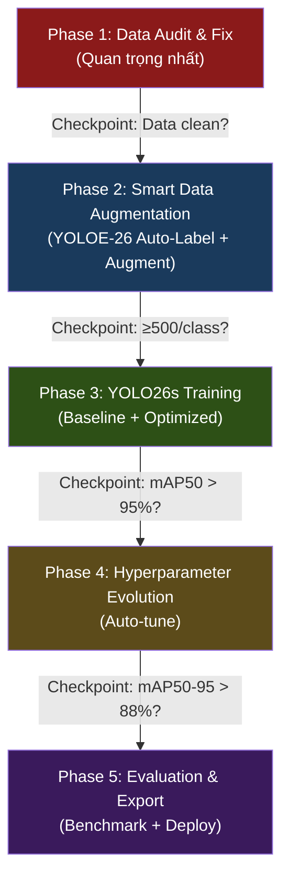

# Triển Khai YOLO26 Tối Ưu Cho Traffic Sign Detection

## Bối cảnh & Vấn đề

Dự án traffic sign detection hiện tại sử dụng **YOLO11n** đạt mAP50=94.66%, nhưng có 3 vấn đề nghiêm trọng cần giải quyết:

1. **Class imbalance**: No_parking bị miss 75%, Go_slowdown gần như không có data
2. **Noisy labels**: Auto-labeling bằng template matching tạo ra nhãn kém chất lượng
3. **Model outdated**: YOLO11n thiếu các tính năng NMS-free, STAL (small-target detection) của YOLO26

**Chiến lược tổng**: Áp dụng nguyên tắc **"Data-First, Model-Second"** — fix data quality trước, rồi mới upgrade model để tối đa hóa lợi ích từ YOLO26.

---

## User Review Required

> [!IMPORTANT]
> **Chọn model size**: Plan này đề xuất dùng **yolo26s** (Small) thay vì `yolo26n` (Nano). Lý do: 6 classes biển báo có sự khác biệt tinh tế (No_parking vs No_parking_stopping) cần feature representation phong phú hơn nano. Nếu bạn ưu tiên tốc độ trên edge device hơn accuracy, có thể chuyển về `yolo26n`.

> [!WARNING]
> **YOLOE-26 Auto-labeling**: Plan sử dụng YOLOE-26 (open-vocabulary model) để tạo pseudo-labels cho data mới. Cần internet để download model lần đầu (~150MB cho yoloe-26s). Bạn có muốn bỏ bước này và dùng manual labeling thay thế?

> [!IMPORTANT]
> **Data bổ sung**: Plan bao gồm script tự động download hình ảnh từ dataset công khai (GTSDB, GTSRB). Nếu bạn chỉ muốn dùng data hiện có, cho biết để tôi điều chỉnh plan.

---

## Proposed Changes

Chiến lược chia thành **5 Phase** thực thi tuần tự, mỗi phase có checkpoint đánh giá trước khi tiếp tục.



---

### Phase 1 — Data Audit & Quality Fix

Mục tiêu: Phân tích, làm sạch, cân bằng dataset hiện tại.

#### [NEW] [data_audit.py](file:///d:/Download/ComputerVision/My-Deep-Learning/demo-application/traffic-sign-detection/source_code/data_audit.py)

Script phân tích dataset YOLO hiện có:
- Thống kê số lượng mẫu per class
- Phát hiện class imbalance (tỷ lệ min/max)
- Kiểm tra label validity (format, bbox bounds)
- Tạo báo cáo trực quan (bar chart, bbox size distribution)
- Output: `data_audit_report.json` + visualization plots

#### [NEW] [data_balance.py](file:///d:/Download/ComputerVision/My-Deep-Learning/demo-application/traffic-sign-detection/source_code/data_balance.py)

Script cân bằng dataset:
- **Oversampling**: Duplicate ảnh chứa minority class (No_parking, Go_slowdown) với random augmentation (flip, brightness, hue shift)
- **Smart copy-paste**: Crop ROI biển báo từ ảnh có → paste vào ảnh background khác
- **Undersample removal**: Nếu 1 class quá dominant (>60% tổng), loại bớt ảnh chỉ chứa class đó
- Target: Mỗi class có **≥300 instances** trong training set

#### [MODIFY] [data.yaml](file:///d:/Download/ComputerVision/My-Deep-Learning/demo-application/traffic-sign-detection/data.yaml)

Cập nhật paths cho dataset đã balance, thêm validation split chính thức (80/20).

---

### Phase 2 — Smart Data Augmentation với YOLOE-26

Mục tiêu: Tận dụng YOLOE-26 open-vocabulary để tạo pseudo-labels từ nguồn data mới, tăng dataset lên ≥500 instances/class.

#### [NEW] [smart_augment.py](file:///d:/Download/ComputerVision/My-Deep-Learning/demo-application/traffic-sign-detection/source_code/smart_augment.py)

Pipeline thông minh:
1. **YOLOE-26 pseudo-labeling**: Dùng YOLOE-26 với text prompt ("no entry sign", "no parking sign", etc.) để auto-detect và label biển báo từ ảnh mới (Google Images, GTSDB dataset)
2. **Confidence filtering**: Chỉ giữ pseudo-labels với confidence ≥ 0.7
3. **Human review interface**: Hiện ảnh + box cho user verify nhanh (accept/reject per image)
4. **Advanced augmentation**: Mosaic, MixUp, Copy-Paste trên dataset đã verify

```python
# Workflow concept
from ultralytics import YOLO

# Step 1: YOLOE-26 pseudo-label
yoloe = YOLO("yoloe-26s-seg.pt")
# Detect "traffic signs" in new images using text prompts
results = yoloe.predict(new_images, texts=["no entry sign", "no parking sign", ...])

# Step 2: Filter high-confidence → convert to YOLO format
# Step 3: Merge with existing verified labels
# Step 4: Augmentation pipeline
```

#### [NEW] [download_external_data.py](file:///d:/Download/ComputerVision/My-Deep-Learning/demo-application/traffic-sign-detection/source_code/download_external_data.py)

Script download và convert ảnh từ public datasets:
- GTSRB (German Traffic Sign Recognition Benchmark) — mapping classes sang 6 classes của dự án
- Chỉ lấy classes tương ứng: No_entry, No_parking, etc.
- Auto-convert sang YOLO format

---

### Phase 3 — YOLO26s Training Pipeline

Mục tiêu: Train YOLO26s với dataset đã clean, đạt baseline mAP50 > 95%.

#### [NEW] [train_yolo26.py](file:///d:/Download/ComputerVision/My-Deep-Learning/demo-application/traffic-sign-detection/source_code/train_yolo26.py)

Training script tối ưu cho YOLO26s:

```python
from ultralytics import YOLO

def train_yolo26_optimized():
    model = YOLO('yolo26s.pt')
    
    results = model.train(
        # === Data ===
        data='data_v2.yaml',          # Dataset đã balance từ Phase 1-2
        imgsz=800,                     # Tăng từ 640 → 800 cho small sign detection
        
        # === Training ===
        epochs=150,                    # YOLO26 MuSGD hội tụ ổn định, train dài hơn
        batch=16,                      # Auto-adjust nếu GPU OOM
        device=0,
        workers=4,
        patience=30,                   # Early stopping nếu 30 epoch không improve
        
        # === Optimizer (YOLO26 MuSGD) ===
        optimizer='auto',              # YOLO26 tự chọn MuSGD
        lr0=0.01,
        lrf=0.001,                     # Final LR = lr0 * lrf
        cos_lr=True,                   # Cosine annealing
        warmup_epochs=5,
        
        # === Augmentation ===
        mosaic=1.0,                    # Mosaic augmentation
        mixup=0.15,                    # MixUp cho diversity
        copy_paste=0.3,               # Copy-paste (critical cho class imbalance)
        degrees=15,                    # Rotation ±15° (biển có thể nghiêng)
        scale=0.5,
        translate=0.2,
        hsv_h=0.02,                    # Color jitter nhẹ
        hsv_s=0.7,
        hsv_v=0.4,
        flipud=0.0,                    # KHÔNG flip dọc (biển báo luôn đứng)
        fliplr=0.0,                    # KHÔNG flip ngang (No_turn_left ≠ No_turn_right)
        erasing=0.3,                   # Random erasing
        
        # === Output ===
        name='yolo26s_traffic_v1',
        save_period=10,                # Save checkpoint mỗi 10 epochs
        plots=True,
        
        # === YOLO26 specific advantage ===
        close_mosaic=15,               # Tắt mosaic 15 epoch cuối để fine-tune
    )
    return results
```

**Key design decisions:**
- `imgsz=800`: Biển báo nhỏ khi xa → resolution cao giúp STAL hoạt động tốt hơn
- `fliplr=0.0, flipud=0.0`: Biển "Cấm rẽ trái" flip ngang = "Cấm rẽ phải" → phá label
- `copy_paste=0.3`: Chiến lược chính chống class imbalance, paste object minority vào ảnh mới
- `close_mosaic=15`: Mosaic giúp early training nhưng gây noise cuối → tắt sớm

#### [NEW] [data_v2.yaml](file:///d:/Download/ComputerVision/My-Deep-Learning/demo-application/traffic-sign-detection/data_v2.yaml)

Dataset config mới cho YOLO26:
- Train/val split: 80/20 stratified (đảm bảo mỗi class có trong val)
- Test set: Tách riêng 10% cho final evaluation
- Path cập nhật cho dataset đã balance

---

### Phase 4 — Hyperparameter Evolution (Tự động tối ưu)

Mục tiêu: Dùng genetic algorithm tự tìm hyperparameters tốt nhất, target mAP50-95 > 88%.

#### [NEW] [tune_yolo26.py](file:///d:/Download/ComputerVision/My-Deep-Learning/demo-application/traffic-sign-detection/source_code/tune_yolo26.py)

```python
from ultralytics import YOLO

def auto_tune():
    # Load best weights từ Phase 3
    model = YOLO('runs/detect/yolo26s_traffic_v1/weights/best.pt')
    
    # Genetic algorithm hyperparameter evolution
    model.tune(
        data='data_v2.yaml',
        epochs=50,              # Epochs per iteration (ngắn hơn để nhanh)
        iterations=100,         # 100 thế hệ evolution
        imgsz=800,
        device=0,
        plots=True,
    )
    # Output: runs/detect/tune/best_hyperparameters.yaml

def train_final():
    # Train lần cuối với best hyperparameters
    model = YOLO('yolo26s.pt')
    model.train(
        data='data_v2.yaml',
        epochs=200,
        imgsz=800,
        device=0,
        cfg='runs/detect/tune/best_hyperparameters.yaml',
        name='yolo26s_traffic_final',
        patience=40,
    )
```

Quy trình: `baseline (Phase 3)` → `tune 100 iterations` → `re-train với best params` → `final model`

---

### Phase 5 — Evaluation, Comparison & Export

Mục tiêu: So sánh khoa học YOLO11n vs YOLO26s, export model cho production.

#### [NEW] [evaluate.py](file:///d:/Download/ComputerVision/My-Deep-Learning/demo-application/traffic-sign-detection/source_code/evaluate.py)

Script đánh giá toàn diện:
- **Per-class comparison**: mAP50, mAP50-95, Precision, Recall cho từng class
- **Speed benchmark**: FPS trên GPU, CPU (YOLO11 NMS vs YOLO26 NMS-free)
- **Confusion matrix comparison**: Side-by-side YOLO11n vs YOLO26s
- **Small object analysis**: Lọc predictions theo bbox size, so sánh recall trên small/medium/large
- Output: Bảng comparison đầy đủ + visualizations

#### [NEW] [export_deploy.py](file:///d:/Download/ComputerVision/My-Deep-Learning/demo-application/traffic-sign-detection/source_code/export_deploy.py)

Export model cho deployment:
- ONNX (CPU inference tối ưu)
- TensorRT (NVIDIA GPU)
- OpenVINO (Intel hardware)
- Validation trên test set sau khi export để đảm bảo quality

#### [MODIFY] [test.py](file:///d:/Download/ComputerVision/My-Deep-Learning/demo-application/traffic-sign-detection/source_code/test.py)

Cập nhật để:
- Load YOLO26 weights thay vì YOLO11
- Loại bỏ NMS manual handling (YOLO26 end-to-end)
- Thêm FPS counter cho benchmark
- Thêm confidence visualization

---

## Open Questions

> [!IMPORTANT]
> **GPU available?** Phase 4 (Hyperparameter evolution 100 iterations × 50 epochs) cần khoảng **12-24 giờ GPU**. Bạn có GPU nào? (RTX 3060/3070/4060/etc.) Nếu GPU yếu, tôi sẽ giảm iterations xuống 30 và dùng `yolo26n` cho tune, rồi transfer sang `yolo26s`.

> [!IMPORTANT]
> **Dataset hiện tại có bao nhiêu ảnh per class?** Từ confusion matrix thấy No_parking và Go_slowdown rất yếu, nhưng cần biết con số cụ thể để quyết định cần thu thập thêm bao nhiêu. Bạn có thể chạy thử:
> ```bash
> # Đếm labels per class
> python -c "import os; [print(sum(1 for f in open(os.path.join('datasets/labels/train',l)) for line in f if line.startswith(str(c)))) for c in range(6)]"
> ```

> [!WARNING]
> **External data (GTSRB/GTSDB)**: Nếu bạn không muốn download dataset bên ngoài, tôi sẽ tập trung 100% vào augmentation từ data hiện có (oversampling + mosaic + copy-paste). Hiệu quả sẽ thấp hơn nhưng vẫn khả thi.

---

## Verification Plan

### Automated Tests

Mỗi Phase có checkpoint metrics rõ ràng:

| Phase | Checkpoint | Metric mục tiêu | Hành động nếu fail |
|:---|:---|:---|:---|
| **Phase 1** | Data audit | Mỗi class ≥ 100 instances, no corrupt labels | Thu thập thêm data |
| **Phase 2** | After augment | Mỗi class ≥ 300-500 instances | Thêm external data |
| **Phase 3** | Baseline train | mAP50 > 95%, mAP50-95 > 85% | Tăng imgsz, dùng yolo26m |
| **Phase 4** | After tune | mAP50-95 > 88%, recall > 85% | Tăng iterations, review data |
| **Phase 5** | Final eval | All-class recall > 80%, FPS > 30 (GPU) | Optimize export settings |

```bash
# Validation commands chạy sau mỗi phase
yolo val model=runs/detect/yolo26s_traffic_v1/weights/best.pt data=data_v2.yaml imgsz=800
yolo benchmark model=best.pt imgsz=800 device=0
```

### Manual Verification

1. **Visual inspection**: Chạy inference trên video gốc (`train_video.mp4`), so sánh visual output YOLO11n vs YOLO26s
2. **Edge cases**: Test riêng trên ảnh biển báo nhỏ, xa, bị che khuất, điều kiện ánh sáng yếu
3. **Per-class deep dive**: Review false positives/negatives của từng class qua confusion matrix mới

### Comparison Report

Tạo side-by-side report cuối cùng:

| Metric | YOLO11n (hiện tại) | YOLO26s (mục tiêu) |
|:---|:---|:---|
| mAP50 | 94.66% | **≥ 97%** |
| mAP50-95 | 84.67% | **≥ 88%** |
| Recall | 77.60% | **≥ 85%** |
| No_parking recall | ~25% | **≥ 70%** |
| Go_slowdown recall | ~0% | **≥ 60%** |
| FPS (GPU) | ~180 | **≥ 150** |
| FPS (CPU) | ~25 | **≥ 35** (NMS-free) |
| Post-processing | NMS needed | **End-to-End** |

---

## Tổng Kết Cấu Trúc File Mới

```
traffic-sign-detection/
├── data.yaml                    # [KEEP] Config cũ (reference)
├── data_v2.yaml                 # [NEW] Config mới cho YOLO26
├── source_code/
│   ├── train.py                 # [KEEP] Script cũ (reference)
│   ├── test.py                  # [MODIFY] Cập nhật cho YOLO26
│   ├── utils.py                 # [KEEP] Giữ nguyên
│   ├── auto_label.py            # [KEEP] Giữ nguyên
│   ├── data_audit.py            # [NEW] Phase 1 — Data analysis
│   ├── data_balance.py          # [NEW] Phase 1 — Data balancing
│   ├── smart_augment.py         # [NEW] Phase 2 — YOLOE-26 pseudo-label
│   ├── download_external_data.py # [NEW] Phase 2 — External data
│   ├── train_yolo26.py          # [NEW] Phase 3 — YOLO26 training
│   ├── tune_yolo26.py           # [NEW] Phase 4 — Auto-tune
│   ├── evaluate.py              # [NEW] Phase 5 — Comparison
│   └── export_deploy.py         # [NEW] Phase 5 — Export
└── runs/
    └── detect/
        ├── traffic_detect_run3/  # [KEEP] YOLO11n results (baseline)
        ├── yolo26s_traffic_v1/   # [NEW] Phase 3 output
        ├── tune/                 # [NEW] Phase 4 output
        └── yolo26s_traffic_final/ # [NEW] Phase 4 final
```
