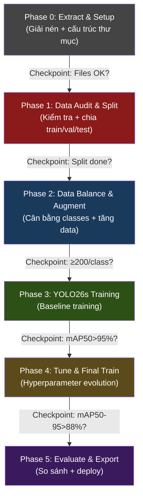

# 🚀 Plan Triển Khai YOLO26 — Traffic Sign Detection

## 📊 Phân Tích Data Thực Tế

Dựa trên `images.zip` và `labels.zip` đã cung cấp:

| Thống kê | Giá trị |
|:---|:---|
| Tổng frames | **3,087** PNG (~7.6 GB) |
| Label files có data | **1,769** (57.3%) |
| Label files rỗng (background) | **1,318** (42.7%) |
| Tổng bounding boxes | **3,820** |
| Nguồn gốc | Frames trích từ video, auto-labeled |

### Class Distribution — Vấn đề chính

```
No_entry (0)          ████████████████████████████  1,423  (37.3%)
Keep_going (5)        █████████████████████         1,068  (28.0%)
No_parking_stop (2)   ████████████                    628  (16.4%)
No_turn_left (3)      ████████                        416  (10.9%)
No_parking (1)        █████                           263  ( 6.9%)
Go_slowdown (4)       ▌                                22  ( 0.6%)  ← 🔴 CRITICAL
```

> [!CAUTION]
> **Imbalance ratio: 64.7x** (No_entry 1,423 vs Go_slowdown 22). Go_slowdown gần như không thể train được với 22 samples. Đây là bottleneck #1.

> [!WARNING]
> **BBox rất nhỏ**: Kích thước trung bình ~0.02×0.03 (normalized) → biển báo chiếm ~0.06% diện tích ảnh. Cần `imgsz≥800` và YOLO26 STAL.

---

## Chiến Lược Tổng Thể



---

## Phase 0 — Extract & Setup

```powershell
cd demo-application/traffic-sign-detection
mkdir datasets
Expand-Archive -Path ..\..\images.zip -DestinationPath datasets\ -Force
Expand-Archive -Path ..\..\labels.zip -DestinationPath datasets\ -Force
pip install ultralytics>=8.3.60 opencv-python matplotlib pyyaml
```

---

## Phase 1 — Data Audit & Train/Val/Test Split

```powershell
python source_code/data_audit.py --data data.yaml --split train
python source_code/data_balance.py --data data.yaml --split all --ensure-splits --output-root datasets_v2 --min-instances 200
```

Split: **70% train / 20% val / 10% test** (stratified theo class)

---

## Phase 2 — Data Balance & Augmentation

| Class | Hiện tại | Mục tiêu | Phương pháp |
|:---|:---|:---|:---|
| No_entry (0) | 1,423 | Giữ nguyên | — |
| Keep_going (5) | 1,068 | Giữ nguyên | — |
| No_parking_stop (2) | 628 | Giữ nguyên | — |
| No_turn_left (3) | 416 | Giữ nguyên | — |
| No_parking (1) | 263 | **≥300** | Oversample + color augment |
| Go_slowdown (4) | **22** | **≥200** | Oversample + augment + copy-paste |

---

## Phase 3 — YOLO26s Training

```powershell
python source_code/train_yolo26.py --model yolo26s.pt --data data_v2.yaml --epochs 150 --imgsz 800 --batch 16 --device 0 --name yolo26s_traffic_v1
```

Key: `imgsz=800`, `fliplr=0.0`, `copy_paste=0.3`, `close_mosaic=15`, `patience=30`

---

## Phase 4 — Hyperparameter Tuning

```powershell
python source_code/tune_yolo26.py --mode tune --weights runs/detect/yolo26s_traffic_v1/weights/best.pt --data data_v2.yaml --imgsz 800 --tune-epochs 50 --iterations 50
python source_code/tune_yolo26.py --mode final --model yolo26s.pt --data data_v2.yaml --cfg runs/detect/tune/best_hyperparameters.yaml --final-epochs 200
```

---

## Phase 5 — Evaluate & Export

### Target Metrics

| Metric | YOLO11n (hiện tại) | YOLO26s (mục tiêu) |
|:---|:---|:---|
| mAP50 | 94.66% | **≥ 97%** |
| mAP50-95 | 84.67% | **≥ 88%** |
| Recall | 77.60% | **≥ 85%** |
| No_parking recall | ~25% | **≥ 70%** |
| Go_slowdown recall | ~0% | **≥ 60%** |

---

## Bugs Cần Fix

| # | File | Bug | Severity |
|:--|:-----|:----|:---------|
| 1 | `data_balance.py` | Thiếu val/test split | 🔴 Critical |
| 2 | `data_balance.py` | Oversample inflate majority | 🟡 Medium |
| 5 | `tune_yolo26.py` | `cfg=` sai parameter | 🔴 Critical |
| 6 | `evaluate.py` | Thiếu per-class metrics | 🔴 Critical |
| 7 | `evaluate.py` | Benchmark không warm-up | 🟡 Medium |

---

## Timeline

| Phase | Thời gian | Yêu cầu |
|:---|:---|:---|
| Phase 0-2 | ~30 phút | CPU only |
| Phase 3 | ~3-6 giờ | GPU (RTX 3060+) |
| Phase 4 | ~8-16 giờ | GPU |
| Phase 5 | ~30 phút | GPU |
| **Tổng** | **~12-23 giờ** | |
